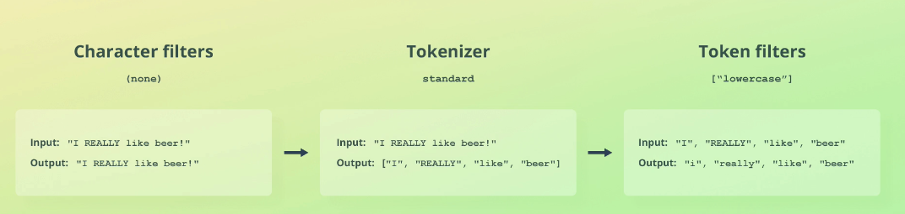
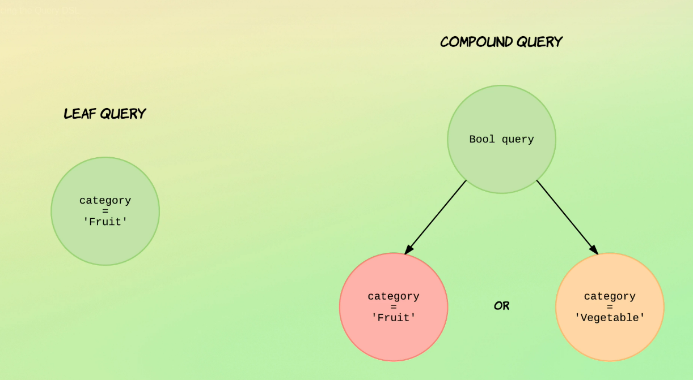
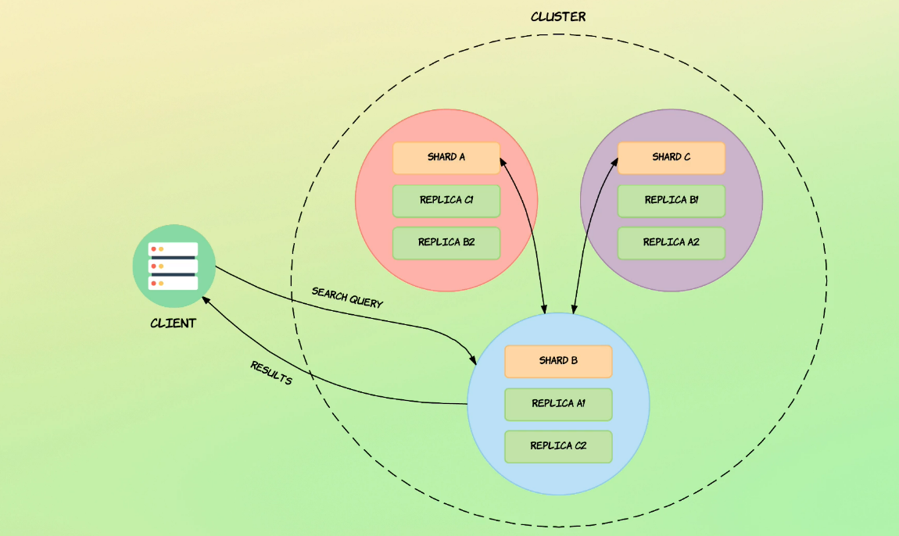

## Elasticsearch

No Elasticsearch os dados são armazenados como documentos, unidades de informação. Analogamento um documento seria um registro de uma tabela em um banco de dados relacional. 

Um documento possui campos que seria equivalente a colunas em bancos relacionais.

Nós comunicamos com Elasticsearch através de chamadas HTTP por uma API rest.

ElasticStack
- Kibana (Análise visual e métricas)
- Logstash (Processar logs e enviar para o Elasticsearch, processamento de pipeline)
- Beats (Coletar dados para Elasticsearch ou Logstash)
- X-Pack (Traz mais funcionalidades para Elasticsearch, segurança, monitoramento)
- Elasticsearch (Engine de busca)

**Características e arquitetura**

**Node:** Uma instância do Elasticsearch que armazena dados. Podemos ter vários nós rodando, um nó se refere a uma instância do Elasticsearch e não a uma máquina, então é possível rodar vários nós em uma mesma máquina. Os dados são distribuídos entre os nós.

**Master Node:** Dentre os nós elegidos como master este é o responsável por criar e delete índices entre os outros.

**Cluster:** Coleção de nós relacionados, clusteres são independentes entre si. 

Documentos são organizados por índices. Um índice agrupa documentos e provê configurações que facilitam disponibilidade e escalibilidade.

*_cat* facilita formatação de dados para visualização. Endereções que começam com _ são de API por convenção.

``GET _cat/nodes?v`` retorna dados sobre os nós

``GET _cat/indices?v`` retorna dados sobre os índices

``GET _shard?v`` retorna dados sobre shards

``GET _cluster/health`` retorna dados sobre o cluster

Executando com cURL

``curl -XGET "http://localhost:9200/_cluster/health"``

<pre><code>curl -XGET "http://es01:9200/.kibana/_search" -H 'Content-Type: application/json' -d'{  "query": {    "match_all": {}  }}'</code></pre>

Sharding: Uma forma de dividir um índice em partes separadas onde que cada parte é chamada de shard. Sharding occore a nível de índice e não de cluster ou nó. Principal motivo para separar um índice em múltiplos shard é para escalar horizontalmente com o volume de dados. Podemos distribuir shard entre múltiplos nós.

Replicação: Por padrão o Elasticseacrh já provê replicação de shards. Replicação é configurado a nível de índice e funciona criando cópias de shards, conhecidas como replica shards. Um shard que foi replicado é chamado de primary shard. Um primary shard e seus replica shards são chamados de replication group. Replica shard são uma cópia completa de um shard. 

Caso não seja definido um id para o documento o Elasticsearch irá gerar um hash único para tal.

Cria um novo índice :
<pre><code>PUT /products
{
  "settings": {
    "number_of_shard": 2,
    "number_of_replicas": 2
  }
}</code></pre> 

Deleta um índice:
``DELETE /pages`` 

Cria um documento:
<pre><code>POST /products/_doc
{
  "name": "Coffe Make",
  "price": 64,
  "in_stock": 10
}</code></pre>

Cria um documento definindo um id:
<pre><code>PUT /products/_doc/1
{
  "name": "Coffe Maker",
  "price": 64,
  "in_stock": 10
}</code></pre>

Retorna documento pelo id:
``GET /products/_doc/1`` 

Atualiza um documento:
<pre><code>POST /products/_update/1
{
  "doc": {
    "in_stock": 0
  }
}</code></pre> 

**Scripting:** Possibilita escrever uma lógica diferente acessando os valores de um documento

Atualiza um documento utilizando o antigo valor:
<pre><code>POST /products/_update/1
{
  "script": {
    "source": "ctx._source.in_stock--"
  }

}</code></pre> 

Atualiza um documento junto com um parâmetro:
<pre><code>POST /products/_update/1
{
  "script": {
    "source": "ctx._source.in_stock -= params.quantity",
    "params": {
      "quantity": 4
    }
  }

}</code></pre> 

Faz um upsert, caso o documento exista aumenta o estoque, caso contrário insere o documento:
<pre><code>POST /products/_update/1
{
  "script": {
    "source": "ctx._source.in_stock++",
  },
  "upsert": {
    "name": "Blender",
    "price": 399,
    "in_stock": 5
  }
}</code></pre> 

Substitui um documento por completo:
<pre><code>PUT /products/_doc/1
{
  {
    "name": "Toaster"
  }
}</code></pre> 

Remove um documento:
``DELETE /products/_doc/1`` 

**Routing:** Processo de resolver um shard para um documento, cálcula onde o documento está de acordo com a quantidade de shardings no índice.

Para ler um documento. Uma requisição é recebida e processada por um nó coordenador. Routing é utilizado para resolver o grupo de repluicação do documento. ARS (Adaptive Replica Selection) é utilizado para enviar a consulta ao melhor shard disponível. Serve como um load balancer. Nó coordenador coleta a response e envia para o client.

Para escrever um documento. Requisição é recebida por um primary shard e encaminhado para suas replicas. Primary terms para se recuprar de falhas.

**Versioning:** O metadado _version de um documento representa em qual versão ele se encontra. Cada vez que alterado ou feita alguma operação em cima ele é incrementando.

**Primary term:** Para garantir que uma versão mais antiga de um documento não substitua uma versão mais recente, cada operação realizada em um documento recebe um número de sequência pelo fragmento primário que coordena essa mudança.

**Sequence number:** É um número sequencial que conta o número de operações que aconteceram no índice

**Optimistic concurrency control:** Previne uma versão antiga de um documento sobrescreva uma nova versão, mantém a sequência correta de operações. 

- if_primary_term
- if_seq_no

Atualiza documentos por query:
<pre><code>POST /products/_update_by_query
{
  "script": {
    "source": "ctx._source.in_stock--"
  },
  "query": {
    "match_all": {}
  }
}</code></pre> 

Atualiza documentos por query, caso tiver conflito continua:
<pre><code>POST /products/_update_by_query
{
  "conflicts": "proceed",
  "script": {
    "source": "ctx._source.in_stock--"
  },
  "query": {
    "match_all": {}
  }
}</code></pre> 

Deleta documentos por query:
<pre><code>POST /products/_delete_by_query
{
  "query": {
    "match_all": {}
  }
}</code></pre> 

**Batch processing:** 

Se uma operação falhar não irá interromper as demais.

*_bulk*: index, create (falha se tiver um documento com mesmo id), update, delete

<pre><code>POST _bulk
{ "index": { "_index": "products", "_id": 200 } }
{ "name: "Expresso Machine",  "price": 199, "in_stock": 5 }
{ "create: { "index": { "_index": "products", "_id": 200 } }
{ "name: "Mil Frather", "price": 149, "in_stock": 14 }</code></pre>

<pre><code>POST _bulk/products
{ "update": {"_id": 200 } }
{ "doc: { "price": 10 } }
{ "delete: { "index": { "_id": 200 } }</code></pre>

**Importando data com curl:**

<pre><code>curl -H "Content-type: application/x-ndjson" -XPOST http://localhost:9200/products/_bulk --data-binary "@products-bulk.json"</code></pre>

**Analysis:** Quando um documento é indexado ele passa pelo processo do analyzer antes de ser armazenado.

1. Character filters: Adiciona, remove ou altera caracteres, analyzers contém zero ou mais character filters. São aplicados na ordem que forem especificados, e.g. *html_strip*
2. Tokenizer: Um analyzer contém apenas um tokenizer. Responsável por separar uma string em tokens.
3. Token filters: Recebe os tokens do tokenizer. Pode remover, adicionar ou alterar tokens. Um analyzer pode ter zero ou mais token filters. e.g. *lowercase*

Elasticsearch possui vários analyzers nativamente, characters filters, tokenizer e token filters. Sendo possível criar um customizado.

Retorna a forma como o analyzer avalia a sentença: 

<pre><code>POST _analyze
{
  "text": "2 guys walk into a bar, but the third... DUCKS! :-)",
  "analyzer": "standard"
}</code></pre>

<pre><code>POST _analyze
{
  "text": "2 guys walk into a bar, but the third... DUCKS! :-)",
  "char_filter": [],
  "tokenizer": "standard",
  "filter": ["lowercase"]
}</code></pre>

**Inverted indices:** Mapeamento entre termos e documentos que contenham eles. Termos são os tokens do analyzer. O Elasticsearch usa uma estrutura de dados chamada índice invertido que oferece suporte a pesquisas de texto completo muito rápidas. Um índice invertido lista cada palavra única que aparece em qualquer documento e identifica todos os documentos em que cada palavra ocorre. Cada campos textual tem seu próprio índice invertido. Criados e gerenciados pelo Apache Lucene.

**Mapping:** Define uma estrutrua para um documento, seus campos e tipo de dado. Configuração de como os valores são indexados. Comparando ao banco de dados relacional seria como o schema de uma tabela. Mapping de um documento pode ser explícito, definindo manualmente os tipos e valores, ou dinâmico onde o Elasticsearch gerará o mapping quando os documentos são indexados.

**Tipos de dados**: <a href="https://www.elastic.co/guide/en/elasticsearch/reference/current/mapping-types.html">Documentação</a>

Alguns casos:

- nested (consulta de objetos, arrays de forma individual)
- object
- keyword (busca por valores exatos, não é divdido em outros tokens, mantém o campo como um único)
- text (sem necessariamente serem exatos)

Análise de como campos marcados como keyword são análisados.

<pre><code>POST _analyze
{
  "text": "2 guys walk into a bar, bar the third... DUCKS! :-)",
  "analyzer": "keyword"
}</code></pre>

Resultado:

<pre><code>{
  "tokens" : [
    {
      "token" : "2 guys walk into a bar, bar the third... DUCKS! :-)",
      "start_offset" : 0,
      "end_offset" : 51,
      "type" : "word",
      "position" : 0
    }
  ]
}</code></pre>

Análise padrão:

<pre><code>POST _analyze
{
  "text": "2 guys walk into a bar, bar the third... DUCKS! :-)",
  "analyzer": "standard"
}</code></pre>

Resultado: 

<pre><code>{
  "tokens" : [
    {
      "token" : "2",
      "start_offset" : 0,
      "end_offset" : 1,
      "type" : "<NUM>",
      "position" : 0
    },
    {
      "token" : "guys",
      "start_offset" : 2,
      "end_offset" : 6,
      "type" : "<ALPHANUM>",
      "position" : 1
    },
    {
      "token" : "walk",
      "start_offset" : 7,
      "end_offset" : 11,
      "type" : "<ALPHANUM>",
      "position" : 2
    },
    {
      "token" : "into",
      "start_offset" : 12,
      "end_offset" : 16,
      "type" : "<ALPHANUM>",
      "position" : 3
    },
    {
      "token" : "a",
      "start_offset" : 17,
      "end_offset" : 18,
      "type" : "<ALPHANUM>",
      "position" : 4
    },
    {
      "token" : "bar",
      "start_offset" : 19,
      "end_offset" : 22,
      "type" : "<ALPHANUM>",
      "position" : 5
    },
    {
      "token" : "bar",
      "start_offset" : 24,
      "end_offset" : 27,
      "type" : "<ALPHANUM>",
      "position" : 6
    },
    {
      "token" : "the",
      "start_offset" : 28,
      "end_offset" : 31,
      "type" : "<ALPHANUM>",
      "position" : 7
    },
    {
      "token" : "third",
      "start_offset" : 32,
      "end_offset" : 37,
      "type" : "<ALPHANUM>",
      "position" : 8
    },
    {
      "token" : "ducks",
      "start_offset" : 41,
      "end_offset" : 46,
      "type" : "<ALPHANUM>",
      "position" : 9
    }
  ]
}</code></pre>

**Type coersion:** Elasticsearch pode fazer a conversão entre alguns tipos, e.g. um campo notado como float pode receber um float em forma de string que ainda será aceito pela coerção do tipo. Coerção de tipos não é utilizado para o mapping dinâmico. Quando feita consulta em documentos o tipo pode ser armazenado com ostring, como nesse último, apesar de que internamente no Apache Lucene ele será tratado como float. Caso o tipo seja importante para a aplicação pode ser desabilitado a coerção de tipos ou definir o mapping de forma explícita.

**Explicit Mapping:** 

<pre><code>PUT /reviews
{
  "mappings": {
    "properties": {
      "rating": { "type": "float"},
      "content": { "type": "text"},
      "product_id": {"type": "integer" },
      "author": { 
        "properties": {
          "first_name": {"type": "text" },
          "last_name": {"type": "text" },
          "email": {"type": "keyword" }
        }
      }
    }
  }
}</code></pre>

Adicionar mapping para um index: 

<pre><code>PUT /reviews/_mapping
{
  "properties": {
    "created_at": { "type": "date"}
  }
}</code></pre>

Retorna mapping de um index:
``GET /reviews/_mapping``

**Multi mapping:** Um atributo pode ser definido com mais de um tipo e utilizado dependendo do contexto, isso pode ser útil em um campo de string por exemplo, onde em momentos queremos tratar ele como keyword, sendo exato, e para busca textual por completo como text. A definição de multi-mapping é dada pela propriedade fields.

<pre><code>PUT my_index
{
  "mappings": {
    "_doc": {
      "properties": {
        "city": {
          "type": "text",
          "fields": {
            "raw": { 
              "type":  "keyword"
            }
          }
        }
      }
    }
  }
}</code></pre>

Acessando pelo valor padrão, text, e pelo raw que é keyword:

<pre><code>GET my_index/_search
{
  "query": {
    "match": {
      "city": "york" 
    }
  },
  "sort": {
    "city.raw": "asc" 
  },
}</code></pre>

**Dates:** Podem ser armazenadas de três formas, em strings formatadas para uma data, como milisegundo em um long e em segundos desde a época em um integer.

- date (data com tempo, sem tempo e milisegundos desde a época)

Apenas data:

<pre><code>PUT /reviews/_doc/2
{
  "rating": 4.5,
  "content": "Not bad. Not bad at all!",
  "product_id": 123,
  "created_at": "2015-03-27",
  "author": {
    "first_name": "Average",
    "last_name": "Joe",
    "email": "avgjoe@example.com"
  }
}</code></pre>

Data e tempo:
<pre><code>PUT /reviews/_doc/3
{
  "rating": 3.5,
  "content": "Could be better",
  "product_id": 123,
  "created_at": "2015-04-15T13:07:41Z",
  "author": {
    "first_name": "Spencer",
    "last_name": "Pearson",
    "email": "spearson@example.com"
  }
}</code></pre>

Com timezone:

<pre><code>PUT /reviews/_doc/4
{
  "rating": 5.0,
  "content": "Incredible!",
  "product_id": 123,
  "created_at": "2015-01-28T09:21:51+01:00",
  "author": {
    "first_name": "Adam",
    "last_name": "Jones",
    "email": "adam.jones@example.com"
  }
}</code></pre>

Como timestamp (milisegundos desde a eṕoca)
<pre><code>PUT /reviews/_doc/5
{
  "rating": 4.5,
  "content": "Very useful",
  "product_id": 123,
  "created_at": 1436011284000,
  "author": {
    "first_name": "Taylor",
    "last_name": "West",
    "email": "twest@example.com"
  }
}</code></pre>

**Parâmetros para mapping:** 

- format (utilizado para customizar o formato de uma data, DataFormatter Java)

<pre><code>PUT /sales
{
  "mappings": {
    "properties": {
      "purchaed_at": {
        "type": "date",
        "format": "dd/MM/yyyy"
      }
    }
  }
}</code></pre>

- coerce (Habilita ou desabilitar coerção de tipos)

<pre><code>PUT /sales
{
  "mappings": {
    "properties": {
      "amount": {
        "type": "float",
        "coerce": false
      }
    }
  }
}</code></pre>

- norms (fatores de normalização para score de relevância, campos que não são utilizados para o score de relevância, capos que são utilizados apenas para ordenar e agregações)

<pre><code>PUT /sales
{
  "mappings": {
    "properties": {
      "tags": {
        "type": "float",
        "norms": false
      }
    }
  }
}</code></pre>

- index (desabilita a indexação para um campo, ele será armazenado, mas não tem efeito prático para consultas)

<pre><code>PUT /sales
{
  "mappings": {
    "properties": {
      "server_id": {
        "type": "integer",
        "index": false
      }
    }
  }
}</code></pre>

- null_values (valores nulos não podem ser indexados ou consultados, substituído pelo valor definido)

<pre><code>PUT /sales
{
  "mappings": {
    "properties": {
      "partner_id": {
        "type": "keyword",
        "null_value": "NULL"
      }
    }
  }
}</code></pre>

**Reindexando documentos para outro index:**

1. Criar um novo índice

<pre><code>PUT /reviews_new
{
  "mappings": {
    "properties": {
      "rating": { "type": "float"},
      "content": { "type": "text"},
      "product_id": {"type": "keyword" },
      "author": { 
        "properties": {
          "first_name": {"type": "text" },
          "last_name": {"type": "text" },
          "email": {"type": "keyword" }
        }
      }
    }
  }
}</code></pre>

2. Reindexando com a api _reindex

<pre><code>POST _reindex
{
  "source": {
    "index": "reviews"
  },
  "dest": {
    "index": "reviews_new"
  },
  "script": {
    "source": """
      if(ctx._source.product_id != null){
        ctx._source.product_id = ctx._source.product_id.toString();
      }
    """
  }
}</code></pre>

Note que é necessário utilizar um script para converter o id do produto para um string o que antes era um integer, isso é necessário pois apenas o fato de reindexar um documento não implica nos documentos já existentes.

Com a API de _index podemos reindexar documentos que atendem uma query, não incluir algum campo do documento no novo índice.

<a href="https://www.elastic.co/guide/en/elasticsearch/reference/current/docs-index_.html">Documentação</a>

**Configurando dynamic mapping:** Quando criamos um índice com dynamic mapping desligado ele somente irá indexar os campos explícitos, os demais campos serão aceitos ao indexar um documento, mas não podem ser utilizados para consulta, por exemplo.

<pre><code>PUT /people
{
  "mappings": {
    "dynamic": false
    "properties": {
      "first_name": {
        "type": "text
      }
    }
  }
}</code></pre>

Para rejeitar documentos que estejam fora do mapping definido é necessário mudar o valor de dynamic para *"strict"*

**Stemming:** Processo de reduzir uma palavra para sua forma "raiz". O processo de stemming garante que as variações de uma palavra possam ser consultadas em um contexto, e.g. walking e walked pode virar walk.

**Stop word:** Palavras que são filtradas fora durante a análise do texto, e.g. "a", "o", "de", "da".

**Analyzers:**

- standard (separa o texto e remove pontuações)
  - standard tokenizer;
  - letras em minúsculo pelo token filter;
  - stop token filter, desabilitado por padrão;
  - "Is that Peter's cute-looking dog?" --> ["is", "that", "peter's", "cute", "looking", "dog"]
- simple (separa em token quando encontra qualquer coisa que não seja uma letra)
- whitespace (separa em token quando encontra um espaço, não passa pelo processo de converter o texto para letra minúsculas)
- keyword (mantém o texto intacto)
- pattern (define um regex para separar os tokens)

Criando um analyzer customizado:
<pre><code>PUT /products
{
  "settings": {
    "analysis": {
      "analyzer": {
        "remove_english_stop_words": {
          "type": "standard",
          "stopwords": "_english_"
        }
      }
    }
  }
}</code></pre>

Utilizando o analyzer
<pre><code>PUT /products/_mapping
{
  "properties": {
    "description": {
      "type": "text",
      "analyzer": "remove_english_stop_words"
    }
  }
}</code></pre>

Exemplo para um analyzer com diferentes stopwords:
<pre><code>PUT /my-index-000001
{
  "settings": {
    "analysis": {
      "analyzer": {
        "default": {
          "tokenizer": "whitespace",
          "filter": [ "my_custom_stop_words_filter" ]
        }
      },
      "filter": {
        "my_custom_stop_words_filter": {
          "type": "stop",
          "ignore_case": true,
          "stopwords": [ "and", "is", "the" ]
        }
      }
    }
  }
}</code></pre>

Para atualizar um analyzer depois de um índice criado é necessário que o mesmo esteja fechado, entende-se por fechado como um índice que não recebe nem escreve dados. 

Fechando um índice: 

``POST /my-index-000001/_close``

Atualizando um analyzer (utiliza a mesma estrutura antes declarada): 

<pre><code><pre><code>PUT /my-index-000001/_settings
{
  "analysis": {
    "analyzer": {
      "default": {
        "tokenizer": "standard",
        "filter": [ "my_custom_stop_words_filter" ]
      }
    },
    "filter": {
      "my_custom_stop_words_filter": {
        "type": "stop",
        "ignore_case": true,
        "stopwords": [ "and", "is", "the", "an", "on"]
      }
    }
  }
}</code></pre></code></pre>

Abrindo um índice: 

``POST /my-index-000001/_open``

Após ter alterado um analyzer documentos antigos ainda estarão sendo tratados como antigo, para isso podemos atualizar os documentos da seguinte forma:

``POST /my-index-000001/_update_by_query?conflicts=proceed``

**Query DSL:** 

Existem dois principais tipos de queries, leaf queries e compound queries.

Exemplo básico de uma leaft query:

<pre><code>GET /product/_search
{
  "query": {
    "match_all": {}
  }
}</code></pre>

- match_all retorna todos documentos

Fluxo de uma busca em cluster com três nós: 

Detalhando dados sobre a consulta:

<pre><code>GET /product/1/_explain
{
  "query": {
    "term": {
      "name": "lobster"
    }
  }
}</code></pre>

Uma consulta pode ser executada em dois contexto, *query context* e *filter context*.

**Query context:** O quão bem os documentos atendem a consulta.?

**Filter context:** Esses documentos atendem essa consulta? (Sem score de relevância, já que o documento atende a consulta ou não), e.g. filtar por datas, status, período.

**Full text queries vs term level queries:** 

- term queries funcionam como consultas exatas, e.g busca por inteiros, datas e não por sentenças
- full text queries são analisadas e então retornam os documentos por sua relevância

Exemplo de term query: 

<pre><code>GET /products/_search
{
  "query": {
    "term": {
      "name": "lobster"
    }
  }
}</code></pre>

Note que será feita a consulta como os dados estão armazenados no índice invertido e não o que é retornado no *_source* em si.

Exemplo de full text query: 

<pre><code>GET /products/_search
{
  "query": {
    "match": {
      "name": "lobster"
    }
  }
}</code></pre>

Term query com múltiplos campos:

<pre><code>GET /products/_search
{
  "query": {
    "terms": {
      "tags.keyword": ["lobster", "soup"]
    }
  }
}</code></pre>

*Similiar a cláusala IN em bancos relacionais*

Consultando por um grupos de ID's

<pre><code>GET /products/_search
{
  "query": {
    "ids":  {
      "values": [1, 2, 3]
    }
  }
}</code></pre>

Consultando por período:

<pre><code>GET /products/_search
{
  "query": {
    "range": {
      "in_stock": {
        "gte": 1,
        "lte": 5 
      }
    }
  }
}</code></pre>

Consultando documento com campos não nulos:

<pre><code>GET /products/_search
{
  "query": {
    "exists": {
      "field": "tags"
    }
  }
}</code></pre>

Consultada beaseada em prefixos:

<pre><code>GET /product/_search
{
  "query": {
    "prefix": {
      "tags.keyword": "Vege"
    }
  }
}</code></pre>

Consultando com wildcards: 

<pre><code>GET /product/_search
{
  "query": {
    "wildcard": {
      "tags.keyword": "Ve*"
    }
  }
}</code></pre>

***

Venda menor que dez:

<pre><code>GET /products/_search
{
  "query": {
    "range": {
      "sold": {
        "lt": 10
      }
    }
  }
}</code></pre>

Venda menor que trinta e maior ou igual a dez:

<pre><code>GET /products/_search
{
  "query": {
    "range": {
      "sold": {
        "lt": 30,
        "gte": 10
      }
    }
  }
}</code></pre>

Com tag igual a Meat:

<pre><code>GET /products/_search
{
  "query": {
    "term": {
      "tags.keyword": "Meat"
    }
  }
}</code></pre>

Nome como Tomato ou Paste:

<pre><code>GET /products/_search
{
  "query": {
    "terms": {
      "name.keyword": ["Tomato", "Paste"]
    }
  }
}</code></pre>

Categoria começando como past:

<pre><code>GET /products/_search
{
  "query": {
    "wildcard": {
      "tags.keyword": "Past?"
    }
  }
}</code></pre>

Nome que contenha ao menos um número:

<pre><code>GET /products/_search
{
  "query": {
    "regexp": {
      "name": "[0-9]+"
    }
  }
}</code></pre>

**Full text queries:**

Por padrão o operador para consulta será *OR*, ou seja, não necessita ter todas palavras da sentença

<pre><code>GET /recipe/_search
{
  "query": {
    "match": {
      "title": "Recipes with pasta or spaghetti"
    }
  }
}</code></pre>

Podemos mudar o padrão para o operador *AND*

<pre><code>GET /recipe/_search
{
  "query": {
    "match": {
      "title": {
        "query": "Recipes with pasta or spaghetti",
        "operator": "and"
      }
    }
  }
}</code></pre>

Em consultas que utilizam *match* a ordem que os termos aparecem na sentença não importa.

Quando a ordem das palavras importa pode ser utilizado *match_phrase*

<pre><code>GET /recite/_search
{
  "query": {
    "match_phrase": {
      "title": "spaghetti puttanesca"
    }
  }
}</code></pre>

Buscando por múltiplos campos:

<pre><code>GET /recipe/_search
{
  "query": {
    "multi_match": {
      "query": "pasta",
      "fields": ["title", "description"]
    }
  }
}</code></pre>

**Boolean queries:**

Receitas com ingrediente parmesão, sem tuna como ingrediente, tempo de preparo menor ou igual a 15 minutos. A receita ter salsinha aumenta a relevância de um documento:

<pre><code>GET /recipe/_search
{
  "query": {
    "bool": {
      "must": [
        {
          "match": {
            "ingredients.name": "parmesan"
          }
        }
      ],
      "must_not": [
        {
          "match": {
            "ingredients.name": "tuna"
          }
        }
      ],
      "should": [
        {
          "match": {
            "ingredients.name": "parsley"
          }
        }
      ],
      "filter": [
        {
          "range": {
            "preparation_time_minutes": {
              "lte": 15
            }
          }
        }
      ]
    }
  }
}</code></pre>

Exibindo no resultado quais cláusulas foram encontradas em um documento:

<pre><code>GET /recipe/_search
{
  "query": {
    "bool": {
      "must": [
        {
          "match": {
            "ingredients.name": {
              "query": "parmesan",
              "_name": "parmesan_must"
            }
          }
        },
      ],
      "must_not": [
        {
          "match": {
            "ingredients.name": {
              "query": "tuna",
              "_name": "tuna_must_not"
            }
          }
        }
      ],
    }
  }
}</code></pre>

Se uma bool query contém pelo menos uma cláusala *should* e não possui nenhum *filter* ou *must* pelo menos uma das cláusulas de *should* deve ser atendida, caso tenha algum *filter* ou *must* a claúsala *should* não necessariamente precisa ser atendida. Esse comportamento pode ser alterado adicionando *minimum_should_match*.

Deve conter tuna ou parmesão e ter 30 minutos de tempo de preparo:

<pre><code>GET /recipe/_search
{
  "query": {
    "bool": {
      "minimum_should_match": 1,
      "should": [
        {
          "match": {
            "title": {
              "query": "tuna",
              "_name": "should_tuna"
            }
          }
        },
        {
          "match": {
            "title": {
              "query": "parmesan",
              "_name": "should_parmesan"
            }
          }
        }
      ],
      "filter": [
        {
          "term": {
            "preparation_time_minutes": 30
          }
        }
      ]
    }
  }
}</code></pre>

Data de captura maior ou igual a 01/06/2020 e portal igual a 160:

<pre><code>GET busca/_search
{
   "query":{
      "bool":{
         "must":[
            {
               "range":{
                  "dataCaptura":{
                     "gte": "01/06/2020"
                  }
               }
            },
            {
               "term":{
                  "portal": 160
               }
            }
         ]
      }
   }
}</code></pre>

