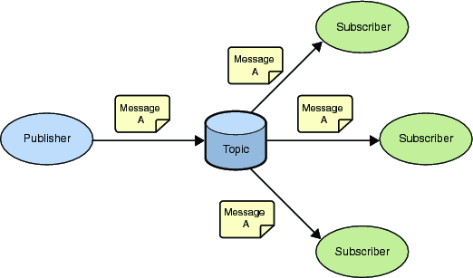

## Pub/Sub

O padrão Pub/Sub é uma das possíveis formas de atingir mensageria entre aplicações. Esse padrão funciona de forma parecida ao padrão de projeto Observer, o Pub/Sub possui duas principais peças, os publisher e subscribers. O papel de um publisher e publicar um evento, uma mensagem, a partir do evento publicado em um topic/channel os subscribers que estão inscritos nesse topic/channel irão receber a mensagem. Sendo que quando um subscriber recebe um evento publicado não existe um caminho contrário, o publisher não é avisado que algum subscriber recebeu ou deixou de receber. Esse processo de transmissão entre aplicações pode ser chamada de broadcast, no caso desse padrão caso não tenha nenhum subscriber no momento em que um evento foi publicado pode ser que ele seja perdido, visto que as chamadas não persistidas e são êfemeras. Importante ressaltar que esse padrão não utiliza uma fila pra processar essas chamadas e que um evento pode ser publicado para *n* subscribers.

Fonte: https://blogs.oracle.com/integration/integration-patterns-publishsubscribe-part1

Existem algumas ferramentas para facilitar o uso do padrão Pub/Sub, este pode ser atingindo utilizando o Redis, ActiveMQ, Kafka etc.

## Message Queue

A ideia principal por trás das filas, *task queues*, é evitar realizar uma tarefa que consome muitos recursos imediatamente e ter que esperar que ela seja concluída. Em vez disso, agendamos a tarefa para ser realizada mais tarde. Encapsulamos uma tarefa como uma mensagem e a enviamos para a fila. Um processo de trabalho em execução em segundo plano exibirá as tarefas e, eventualmente, executará o trabalho. Quando você executa muitos workers, as tarefas são compartilhadas entre eles. Esse conceito é especialmente útil em aplicativos da web onde é impossível lidar com uma tarefa complexa durante uma janela curta de solicitação de HTTP.

Cada evento na fila será consumida por apenas um consumer.

Fonte: https://www.rabbitmq.com/tutorials/tutorial-three-python.html