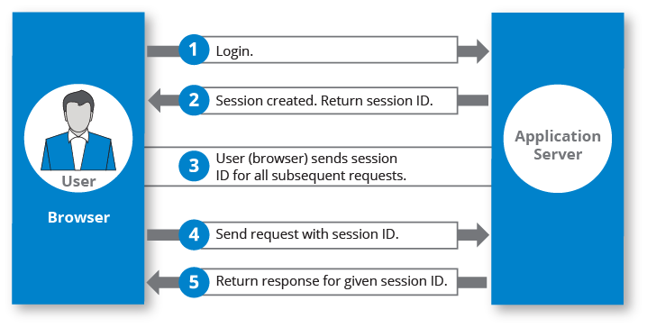
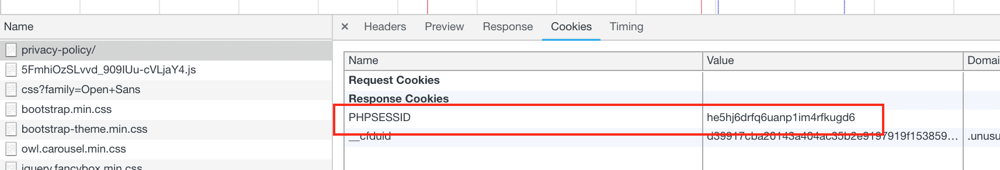

Sessões são uma forma de armazenar dados de um usuário em um servidor web de forma contígua, mantendo as ações realizadas de forma incremental em cima de uma sessão única para cada usuário que utiliza a aplicação. 

Para localizar a sessão de um usuário um ID é registrado no browser assim como o tempo para expirar. Sessões são armazenadas no servidor e normalmente em forma de arquivos temporários.

Um problema comum com sessões é servidores que são escalados horizontalmente e ou utilizam um load balancer. Nesses caso pode ocorrer inconsistência entre sessões visto que pode vir a ocorrer um caso onde as sessões são armazenadas em servidores diferentes. Uma forma de contornar esse problema é configurar o load balancer para lidar com essa situação, utilizar um servidor para replicar sessões ou armazenar de forma externa.

Exemplo de sessão com PHP:

<pre><code>
session_start();
$_SESSION['foo'] = 'bar';

</code></pre>

